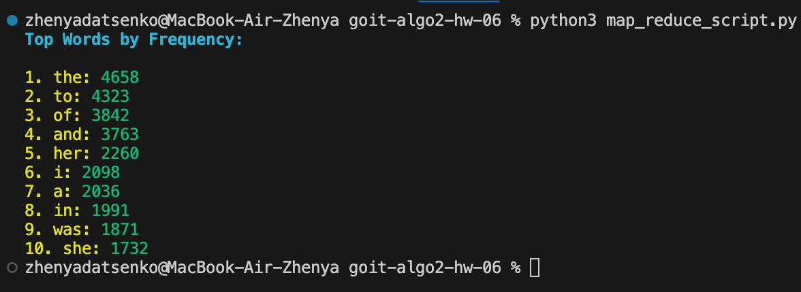

# Home Assignment: MapReduce Text Analysis

This project demonstrates the use of the MapReduce paradigm to analyze the frequency of words in a given text. The script fetches text from a specified URL, processes it using MapReduce, and visualizes the top words by frequency.

## Features

- **Text Fetching**: Retrieves text from a provided URL.
- **MapReduce Processing**: Utilizes the MapReduce model to count the frequency of each word in the text.
- **Visualization**: Displays a bar chart showing the top words by frequency.
- **Parallel Processing**: Employs multiprocessing to enhance performance by processing text chunks concurrently.

## Requirements

- **Python 3**: Ensure Python 3 is installed on your system.
- **Required Libraries**:
  - `requests` for fetching text from URLs.
  - `matplotlib` for visualizing results.
  - `colorama` for colored terminal output.
- **Multiprocessing**: Included in Python's standard library.

## Results

